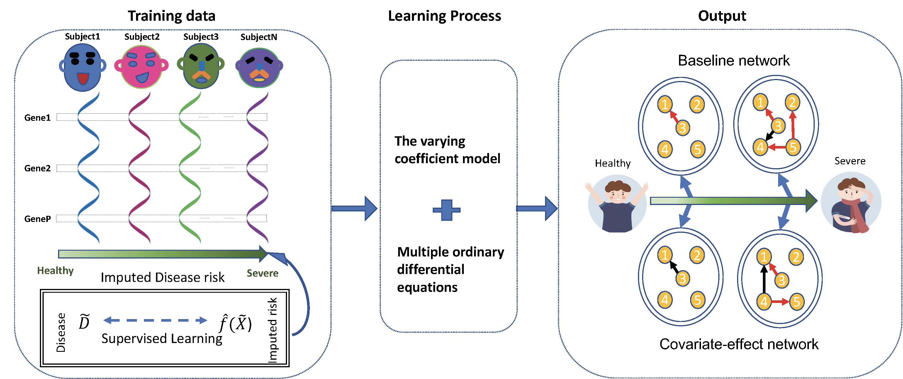

# DRDNetPro: A cartographic tool to infer disease risk from tissue-specific gene expression
<!-- badges: start -->
[](https://github.com/chencxxy28/DRDNetPro/actions)
<!-- badges: end -->




Understanding how genes are differentially expressed across tissues is the key to reveal the etiology of human diseases. Genes never occur in isolation, but rather co-occur in a community and, thus, co-act through an intricate but well-orchestrated networks. Although inferring gene regulatory networks is a fundamental focus of modern genomic research, existing approaches cannot coalesce the full properties of gene-gene communication and interactions into networks. In particular, the unavailability of dynamic gene expression data impairs the application of current network models to unleash the complexity of human diseases. We developed a statistical pipeline called DRDNet to visualize and trace how genes dynamically interact with each other across diverse tissues to shape health risk from static expression data. DRDNet coding all genes into bidirectional, signed, weighted, and feedback looped networks will provide profound genomic information for medical doctors to design precise medicine. 

# Installation

``` r
if (!require("devtools")) {
  install.packages("devtools")
}
devtools::install_github("chencxxy28/DRDNetPro")
```

# Vignettes

Please visit [Tutorial](https://chencxxy28.github.io/DRDNetPro/articles/NAME-OF-VIGNETTE.html)

The DRDNet paper is published at [Bioinformatics](https://academic.oup.com/bioinformatics/article-abstract/38/9/2481/6537533)
